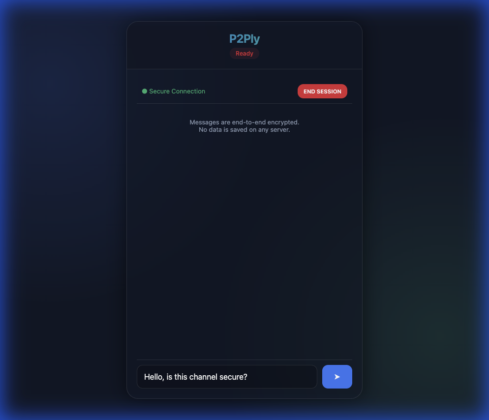
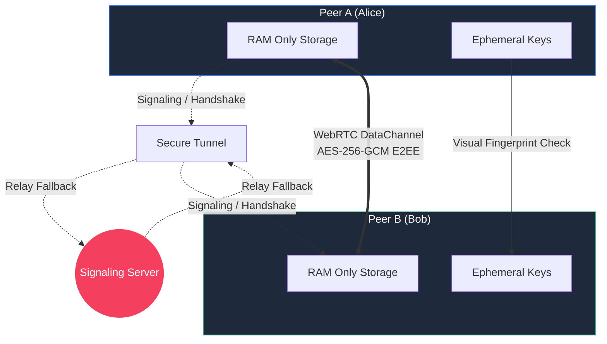

# P2Ply Secure Messenger 🛡️💀

> **PARANOID? GOOD.** You should be.



## Why P2Ply?

Let's face it: **Most "secure" messengers are lying to you.** 
They store your metadata. They back up your chats to their clouds. They comply with "legal requests". They know who you talk to, when, and for how long.

**P2Ply is different.** It is built for the **paranoid**.

*   **NO Database**: We don't have a database. We couldn't store your data if we wanted to.
*   **RAM Only**: Everything lives in your device's memory. Close the tab, and it's **gone forever**.
*   **Visual Identity Check**: Don't trust the code? Trust your eyes. Verify your peer's unique fingerprint visually to ensure no Man-In-The-Middle attack.
*   **Persistenceless**: The server tunneling and keys are destroyed the moment you stop the script. No logs. No traces.

## Architecture



## Features

- 🔒 **True End-to-End Encryption**: powered by Web Crypto API (ECDH + AES-256-GCM).
- 👻 **Ghost Mode**: Minimal footprint. No installation required for clients.
- 🌍 **Instant Global Access**: Generates a secure tunnel (`localhost.run`) automatically.
- 🎨 **Cyberpunk Glassmorphism UI**: Because security should look good.

## Getting Started

1.  **Clone the repo**
    ```bash
    git clone https://github.com/DeepPythonist/p2ply.git
    cd p2ply
    ```

2.  **Launch the Ghost**
    ```bash
    python3 launcher.py
    ```

3.  **Share & Vanish**
    Share the generated link. Verify footprints. Chat. Delete.

## Security Warning ⚠️

While P2Ply uses military-grade encryption, remember:
*   **Trust No One**: Always verify fingerprints.
*   **Browser Isolation**: Use a clean, private browser window.
*   **Endpoint Security**: If your device has malware, no software can save you.

> **Made with 🖤 (and a healthy dose of paranoia)**
>
> If you value your privacy, give us a ⭐ on [GitHub](https://github.com/DeepPythonist/p2ply.git).

---
*P2Ply: Because they ARE watching.*
