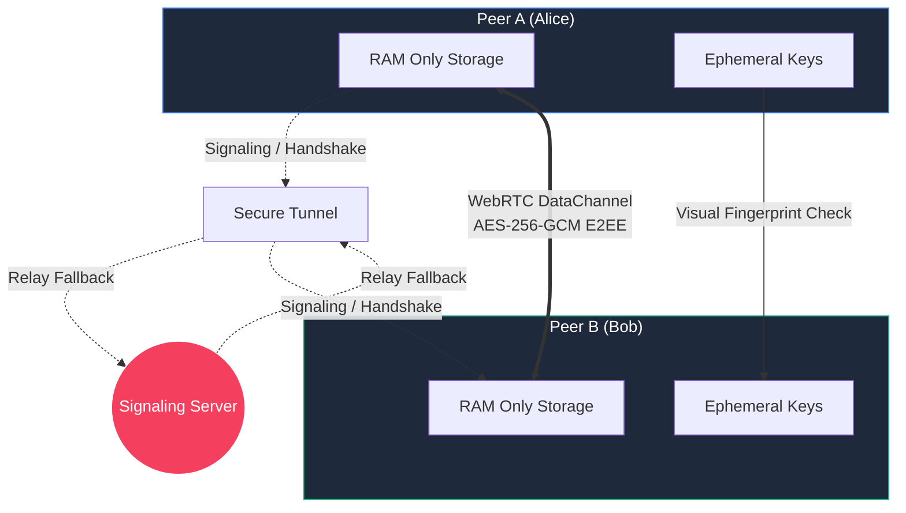

# P2Ply Secure Messenger 🛡️💀

> **PARANOID? GOOD.** You should be.


## Why P2Ply?

Let's face it: **Most "secure" messengers are lying to you.** 
They store your metadata. They back up your chats to their clouds. They comply with "legal requests". They know who you talk to, when, and for how long.

**P2Ply is different.** It is built for the **paranoid**.

*   **NO Database**: We don't have a database. We couldn't store your data if we wanted to.
*   **RAM Only**: Everything lives in your device's memory. Close the tab, and it's **gone forever**.
*   **Visual Identity Check**: Don't trust the code? Trust your eyes. Verify your peer's unique fingerprint visually to ensure no Man-In-The-Middle attack.
*   **Persistenceless**: The server tunneling and keys are destroyed the moment you stop the script. No logs. No traces.

## Getting Started (1-Click Install)

We have created universal installers that automatically handle everything for you. They will:
1.  Check for **Git**, **Python**, and **Node.js**.
2.  **Automatically install** missing tools (using Winget on Windows or guiding you on Mac).
3.  Clone or update the repository.
4.  Launch the application and open your browser securely.

### 🪟 Windows Users
1.  **Download** the `install_win.bat` file.
2.  **Double-click** to run.
3.  *Note: Please turn on your VPN before running if you are in a restricted region.*

### 🍎 Mac Users
1.  **Download** the `install_mac.command` file.
2.  **Double-click** to run.
3.  *Note: You may need to grant execution permissions or trust the script.*

### 🐧 Manual / Linux
```bash
git clone https://github.com/DeepPythonist/p2ply.git
cd p2ply
python3 launcher.py
```

---

## Usage Guide

Follow these steps for a zero-trace communication session:

### Step 1: Initialize
Once the installer finishes, it will automatically open your secure link in the browser. It looks like:
`https://3fd41d4ffe2ae4.lhr.life`

### Step 2: Create Room
1.  Click **"Create Secure Room"**. 
2.  Copy the generated **Invite Link** (e.g., `https://3fd41d4ffe2ae4.lhr.life?code=482910`).

### Step 3: Connect Peer
Send the link to your peer. When they open it and click **"Join Room"**, you will both see the **Security Check**.

### Step 4: Visual Verification (Crucial)
You will see two "Fingerprints" on your screen. 
**Alice's screen MUST show the same Peer Fingerprint that Bob sees as his own Identity.**
*   Ask your peer: *"Does your identity end in A4B2?"*
*   If they match, both click **"YES, CONNECT"**.

### Step 5: Secure Chat
You are now in a **True P2P E2EE** tunnel.
*   No data touches a hard drive.
*   The signaling server only sees encrypted noise.
*   Once you click **"END SESSION"**, the keys are purged from RAM.

---

## Architecture



## Features

- 🔒 **True End-to-End Encryption**: powered by Web Crypto API (ECDH + AES-256-GCM).
- 👻 **Ghost Mode**: Minimal footprint. No installation required for clients.
- 🌍 **Instant Global Access**: Generates a secure tunnel (`localhost.run`) automatically.
- 🎨 **Cyberpunk Glassmorphism UI**: Because security should look good.

## Security Warning ⚠️

While P2Ply uses military-grade encryption, remember:
*   **Trust No One**: Always verify fingerprints.
*   **Browser Isolation**: Use a clean, private browser window.
*   **Endpoint Security**: If your device has malware, no software can save you.

---

> **Made with 🖤 (and a healthy dose of paranoia)**
>
> If you value your privacy, give us a ⭐ on [GitHub](https://github.com/DeepPythonist/p2ply.git).

*P2Ply: Because they ARE watching.*
