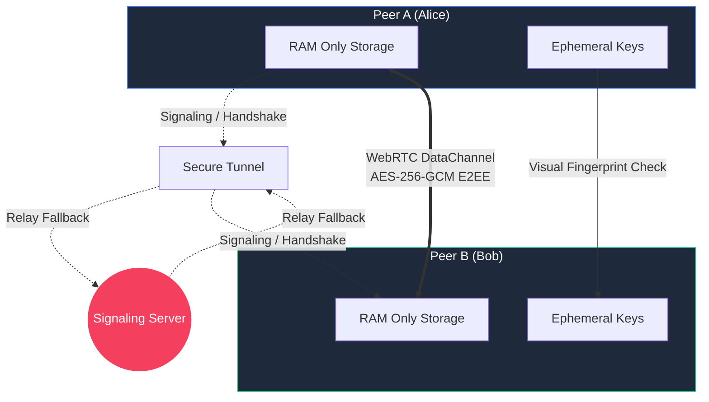

# P2Ply Secure Messenger 🛡️💀

> **PARANOID? GOOD.** You should be.


## Why P2Ply?

Let's face it: **Most "secure" messengers are lying to you.** 
They store your metadata. They back up your chats to their clouds. They comply with "legal requests". They know who you talk to, when, and for how long.

**P2Ply is different.** It is built for the **paranoid**.

*   **NO Database**: We don't have a database. We couldn't store your data if we wanted to.
*   **RAM Only**: Everything lives in your device's memory. Close the tab, and it's **gone forever**.
*   **Visual Identity Check**: Don't trust the code? Trust your eyes. Verify your peer's unique fingerprint visually to ensure no Man-In-The-Middle attack.
*   **Persistenceless**: The server tunneling and keys are destroyed the moment you stop the script. No logs. No traces.

## Architecture



## Features

- 🔒 **True End-to-End Encryption**: powered by Web Crypto API (ECDH + AES-256-GCM).
- 👻 **Ghost Mode**: Minimal footprint. No installation required for clients.
- 🌍 **Instant Global Access**: Generates a secure tunnel (`localhost.run`) automatically.
- 🎨 **Cyberpunk Glassmorphism UI**: Because security should look good.

## Getting Started

### 1. Requirements
Ensure you have **Node.js** and **Python 3** installed on your system. No other external tools are needed.

### 2. Installation
```bash
# Clone the repository
git clone https://github.com/DeepPythonist/p2ply.git
cd p2ply
```

### 3. Launching (Universal Auto-Installer)

**Windows:**
1.  Download/Copy `install_win.bat`.
2.  Run it. 
*(It warns about VPN, installs Git/Python/Node automatically via Winget, clones the repo, and launches the app)*

**Mac:**
1.  Download/Clone and run `install_mac.command`.
*(It warns about VPN, checks for tools, and sets up everything)*

**Manual:**
```bash
# Clone
git clone https://github.com/DeepPythonist/p2ply.git
cd p2ply
# Run
python3 launcher.py
```

---

## Detailed Usage Guide

Follow these steps for a zero-trace communication session:

### Step 1: Initialize the Session
Once you run `launcher.py`, you will see a console output like this:
`[+] REMOTE ACCESS URL: https://3fd41d4ffe2ae4.lhr.life`

Open that URL in your browser. You are now at the **Identity Generation** stage.

### Step 2: Create a Room
1.  Click **"Create Secure Room"**. 
2.  A 6-digit **Pairing Code** will be generated (e.g., `482 910`). 
3.  Click **"Copy Invite Link"**. This link looks like this:  
    `https://3fd41d4ffe2ae4.lhr.life?code=482910`

### Step 3: Invite your Peer
Send that link to the person you want to talk to via any channel. 
> **Note**: Even if this link is intercepted, the attacker cannot decrypt the final chat without passing the next step.

### Step 4: The Handshake
1.  When your peer opens the link, the code is auto-filled. They just click **"Join Room"**.
2.  Both of you will immediately see the **Security Check** screen.

### Step 5: Visual Verification (Crucial)
You will see two "Fingerprints" on your screen. 
**Alice's screen MUST show the same Peer Fingerprint that Bob sees as his own Identity.**
*   Ask your peer: *"Does your identity end in A4B2?"*
*   If they match, both click **"YES, CONNECT"**.

### Step 6: Secure Communication
You are now in a **True P2P E2EE** tunnel. You can chat freely knowing:
*   No data touched a hard drive.
*   The signaling server only saw encrypted noise.
*   Once you click **"END SESSION"**, the keys are purged from RAM.

---

## Security Warning ⚠️

While P2Ply uses military-grade encryption, remember:
*   **Trust No One**: Always verify fingerprints.
*   **Browser Isolation**: Use a clean, private browser window.
*   **Endpoint Security**: If your device has malware, no software can save you.

> **Made with 🖤 (and a healthy dose of paranoia)**
>
> If you value your privacy, give us a ⭐ on [GitHub](https://github.com/DeepPythonist/p2ply.git).

---
*P2Ply: Because they ARE watching.*
